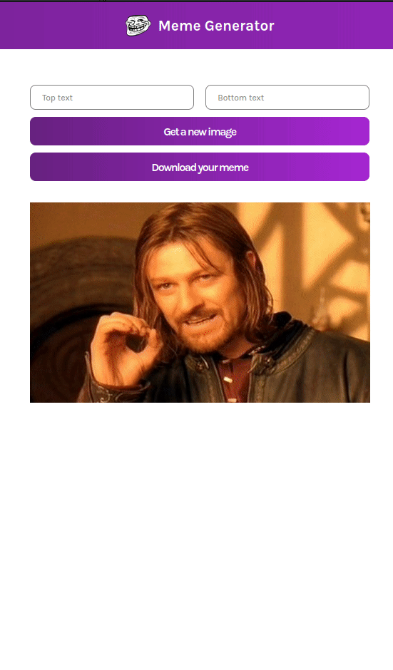
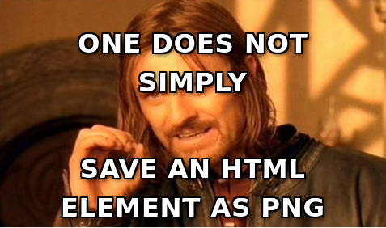
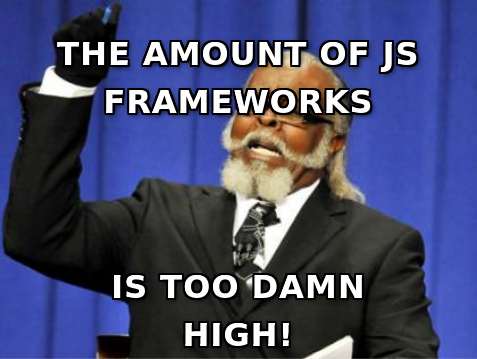

# Meme Generator
A small, web page, made as a React exercise. See it live [here](https://bofmar.github.io/meme-generator). 

This was made as part of the [Learn React for free](https://scrimba.com/learn/learnreact) scrimba course.

Demonstrates the use of React components, props and state.

The site gets a list of meme urls from [imgflip.com](https://imgflip.com/)'s API and renders one of them randomly on the page. The user can then add top and bottom text on the image, or randomly pick a different one.

As an extra challenge, I implemented a download button [using htm2canvas.js](https://html2canvas.hertzen.com/).

## Demo

## Some memes:

